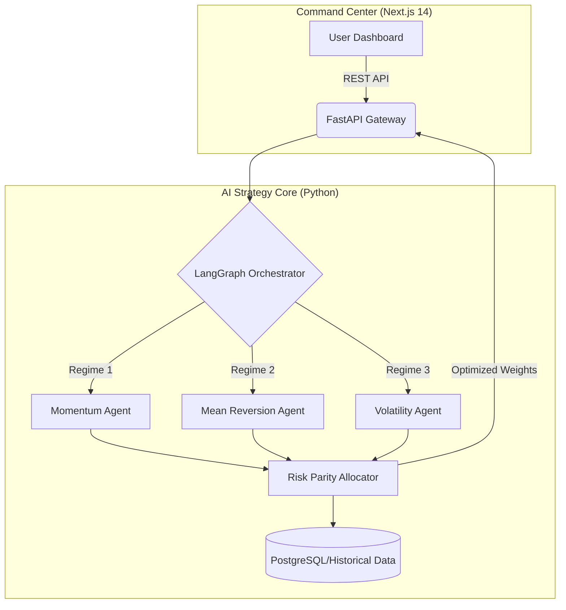

# 📈 Agent-Based Portfolio Strategy Platform


> **Autonomous Hedge-Fund-as-a-Service (HFaaS) Operating System**  
> *A sophisticated financial ecosystem integrating a Python AI core with a modern Next.js interface for risk-aware portfolio allocation.*

## 📌 Executive Summary
This platform simulates an institutional quantitative research environment using an Agent-Based Architecture. Independent AI strategy agents analyze diverse market regimes and generate localized portfolio signals. A hierarchical risk-parity module then actively rebalances the aggregate portfolio to ensure optimal risk distribution across all active strategies.

## 🏗 System Architecture



## 🚀 Key Features
* **Multi-Agent Signal Generation**: Built with LangGraph, allowing independent AI agents to construct differing views of the market without cross-contamination.
* **Recursive Risk Parity (RRP)**: Advanced allocation logic that sizes strategy capital based on historical volatility and correlation, rather than arbitrary capital equal-weighting.
* **Modern Command Center**: "Contra-style" financial OS interface built with Next.js and Tailwind CSS for real-time strategy monitoring.

## 🛠 Tech Stack
* **Backend Intelligence**: `Python 3.11`, `LangGraph`, `FastAPI`, `Pandas`, `Scipy` (for optimization).
* **Frontend Interface**: `Next.js 14`, `React`, `Zustand` (State Management), `Framer Motion`.

## 💻 Setup Instructions

### 1. Start the Strategy Brain (Backend)
```bash
cd backend
python -m venv venv
source venv/bin/activate  # On Windows: venv\Scripts\activate
pip install -r requirements.txt
uvicorn main:app --reload --port 8000
```

### 2. Start the Interface (Frontend)
```bash
cd frontend
npm install
npm run dev
```

---
*Built by [Omii Chauhan](https://github.com/omichauhan-lgtm)*
